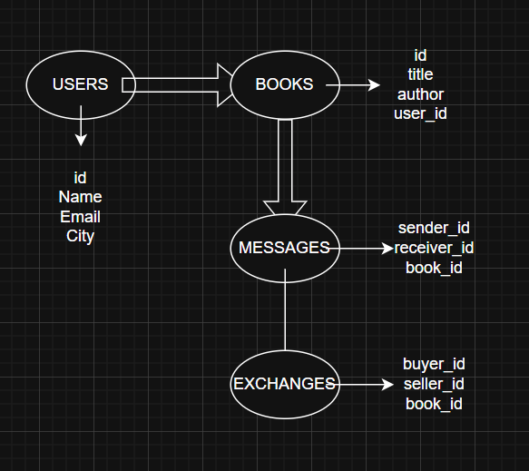

# 📚 Libro a Libro

Plataforma web para compra, venta e intercambio de libros usados, diseñada específicamente para la comunidad de **Mar del Plata**. Una experiencia vintage para amantes de las historias.

## 🚀 Estado del Proyecto: Interfaz Avanzada & Comunidad
El proyecto ha evolucionado de un simple inventario a una plataforma comunitaria con un diseño cuidado y funcional.

### Funcionalidades destacadas:
- **Diseño Vintage & Responsive:** Interfaz inspirada en páginas de libros antiguos, con colores pasteles y tipografías clásicas (Playfair Display y Lora).
- **Agenda Cultural MDQ:** Espacio dedicado a eventos literarios locales, ferias (como la de Plaza Mitre) y clubes de lectura.
- **Sección de Recomendados:** Curaduría de libros destacados con efectos visuales dinámicos (Hover effects).
- **Rincón de Bienestar:** Espacio dedicado a libros de crecimiento personal y autoayuda con estética diferenciada.
- **Mensajería por Hilos:** Sistema de chat organizado por libro y usuario para facilitar los intercambios.
- **Buscador Inteligente:** Filtro en tiempo real por título, autor o género.
- **Gestión de Inventario:** Publicación de libros con carga de imágenes y control de autoría para eliminación.

---

## 🛠️ Tecnologías Implementadas
- **Frontend:** HTML5, CSS3 (Estructura de 2 columnas con Flexbox, Grid y Posicionamiento Sticky).
- **Lógica:** JavaScript (ES6+), manejo de persistencia con `LocalStorage`.
- **Estilos:** Animaciones dinámicas, paleta de colores vintage y diseño adaptable (Mobile First).

---

## 📱 Vista Previa (Versión 2.0)

| Nueva Interfaz & Agenda | Sección Recomendados | Mensajería Interna |
| :---: | :---: | :---: |
|  |  |  |

## 📱 Demostración en Vivo
![Demo de la Plataforma][(/imagenes/Index_recording1.mp4)](https://github.com/user-attachments/assets/24951f37-643c-406a-999b-7db46defb790)
*En este video se puede apreciar el diseño vintage, la navegación por la agenda de MDQ y el efecto de los libros recomendados.*

---

## 🛠️ Guía de Uso Rápido
1. Clonar el repositorio.
2. Abrir `index.html` en el navegador.
3. **Explorar:** Mirá los eventos actuales en Mar del Plata en el margen derecho.
4. **Interactuar:** Iniciá sesión para publicar o contactar vendedores.

---

## 📈 Roadmap (Próximos Pasos)
- [x] **Panel de Comunidad:** Agenda local y recomendaciones fijas.
- [x] **Interfaz Responsive:** Layout de dos columnas adaptable.
- [ ] **Corrección de flujo de chat:** Optimización de recepción de mensajes en tiempo real.
- [ ] **Geolocalización:** Integración directa con mapas para puntos de encuentro en MDQ.
- [ ] **Backend Real:** Migración a Node.js y PostgreSQL para persistencia multi-usuario.

## 📊 Database Diagram

---
Hecho con ❤️ en Mar del Plata.
